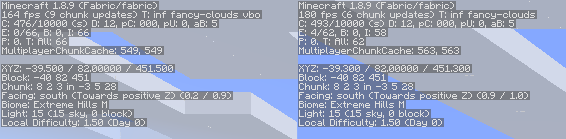

# legacy-lwjgl3

A hacky over-engineered project that runs LWJGL3 on legacy-fabric minecraft versions (current only tested 1.8.9),
Allowing you to use modern LWJGL features and libraries on older minecraft versions.

### Table of Contents
 * [#idk](#idk)
 * Usage
   * [Dev Environments](#Dev Environments)
   * [Clients](#Clients)
 * [Performance Increases?](#Performance Increases?) 
## Credits
A whole lot of this code is just code from the original LWJGL 2 project modified to work with LWJGL 3, Thanks so much to
the LWJGL devs for making their license so permissive.

and a big thanks to gudenau for the original F*rge mod <https://github.com/gudenau/MC-LWJGL3> that did the same thing,
thanks as a big portion of this code is from that project.

# Usage

## Dev Environments
Just add this to your build.gradle to get it running in a dev environment
```groovy
❯ build.gradle

import org.gradle.internal.os.OperatingSystem

project.ext.lwjglVersion = "3.3.1"

switch (OperatingSystem.current()) {
    case OperatingSystem.LINUX:
        project.ext.lwjglNatives = "natives-linux"
        break
    case OperatingSystem.WINDOWS:
        project.ext.lwjglNatives = "natives-windows"
        break
}

repositories {
   maven { url 'https://jitpack.io' }
}

dependencies {
    implementation "com.github.Zarzelcow:legacy-lwjgl3:-SNAPSHOT"
    implementation platform("org.lwjgl:lwjgl-bom:$lwjglVersion")

    runtimeOnly "org.lwjgl:lwjgl::$lwjglNatives"
    runtimeOnly "org.lwjgl:lwjgl-assimp::$lwjglNatives"
    runtimeOnly "org.lwjgl:lwjgl-glfw::$lwjglNatives"
    runtimeOnly "org.lwjgl:lwjgl-openal::$lwjglNatives"
    runtimeOnly "org.lwjgl:lwjgl-opengl::$lwjglNatives"
    runtimeOnly "org.lwjgl:lwjgl-stb::$lwjglNatives"
}

configurations.all {
    // Removes LWJGL2 dependencies
    exclude group: "org.lwjgl.lwjgl"
}
```

## Clients
 TODO... Btw users need to remove lwjgl2 from their classpath by hand as of now
 
# Performance Increases?
While increasing performance was not the main point you do very much so benefit from LWJGl 3's quite substantial performance
bump of about 20 fps even while having to emulate a lot of lwjgl 2 code that got removed.

 <br>
The settings to used are about what you would expect
```yaml
JDK: temurin-17 (Adopt OpenJDK Hotspot 17)
JVM Options:
  -client
  -server
mods:
  - fabricloader 0.13.3,
  - java 17,
  - minecraft 1.8.9
World seed: 123
Options changed from default:
  - Map FPS: unlimited
  - Use VBOS: true
  - VSync: Disabled
```

## Contributing
This project is a work in progress, if you have any suggestions or want to contribute feel free to open an issue or pull
request<br>
**Seriously please I suck at code quality and need people to help me**<br>***Really i w ill accept it im begging you my
code quality is so bad 😭***